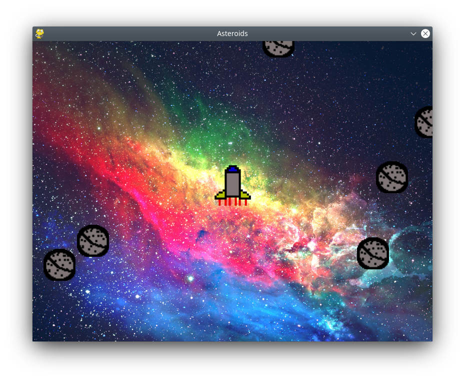

# Asteroids 

2D Game designed to undertsand pygame based off this tutorial: [Link](https://realpython.com/asteroids-game-python)

I will be using the soruce code ideas to add new features

## Features

* Main menu
* Pause Menu
* Restart
* Scores
* Adjustment to parameters
* Different customisations of ships

## Screenshots

-------

